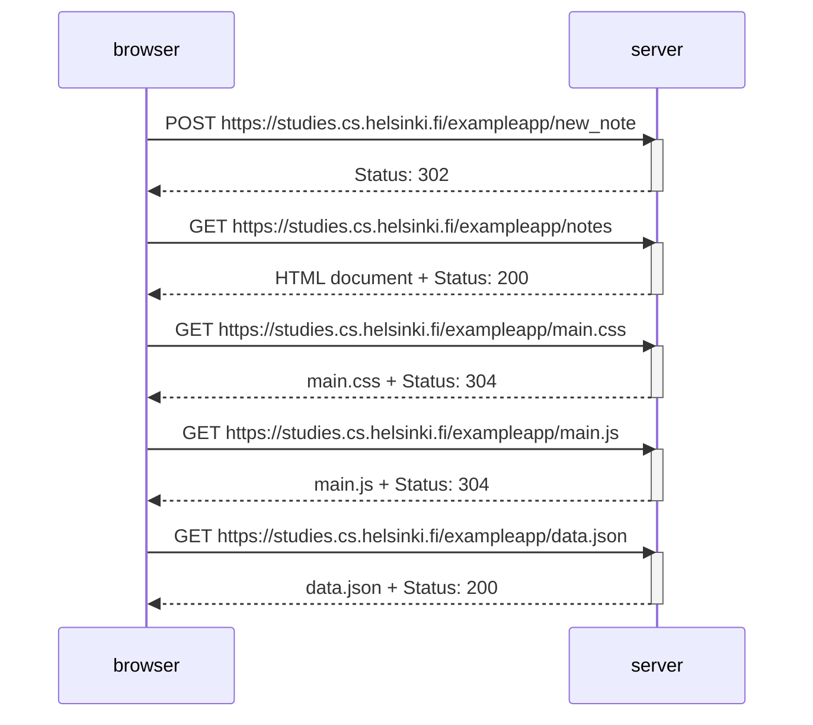

```mermaid
sequenceDiagram
    participant browser
    participant server
    
    browser->>server: POST https://studies.cs.helsinki.fi/exampleapp/new_note
    activate server;
    server-->>browser: Status: 302
    deactivate server;
    
    browser->>server: GET https://studies.cs.helsinki.fi/exampleapp/notes
    activate server;
    server-->>browser: HTML document + Status: 200
    deactivate server;
    
    browser->>server: GET https://studies.cs.helsinki.fi/exampleapp/main.css
    activate server;
    server-->>browser: main.css + Status: 304
    deactivate server;
    browser->>server: GET https://studies.cs.helsinki.fi/exampleapp/main.js
    activate server;
    server-->>browser: main.js + Status: 304
    deactivate server;
    
    browser->>server: GET https://studies.cs.helsinki.fi/exampleapp/data.json
    activate server;
    server-->>browser: data.json + Status: 200
    deactivate server;
```