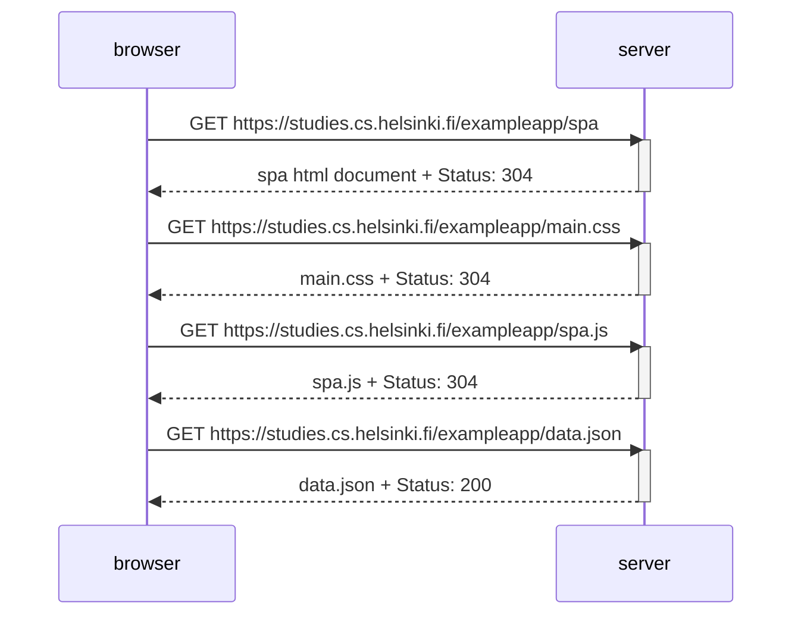

```mermaid
sequenceDiagram
    participant browser
    participant server

    browser->>server: GET https://studies.cs.helsinki.fi/exampleapp/spa;
    activate server;
    server-->>browser: spa html document + Status: 304
    deactivate server;

    browser->>server: GET https://studies.cs.helsinki.fi/exampleapp/main.css
    activate server;
    server-->>browser: main.css + Status: 304
    deactivate server;

    browser->>server: GET https://studies.cs.helsinki.fi/exampleapp/spa.js;
    activate server;
    server-->>browser: spa.js + Status: 304
    deactivate server;

    browser->>server: GET https://studies.cs.helsinki.fi/exampleapp/data.json;
    activate server;
    server-->>browser: data.json + Status: 200
    deactivate server;
    
     
```